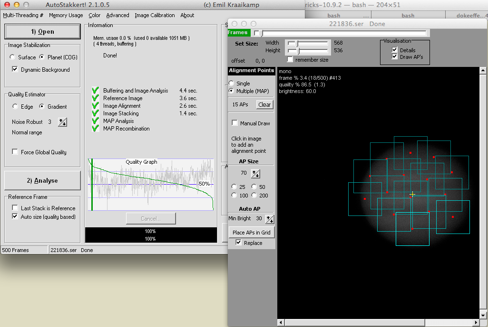

Creating a wine wrapper for Autostakkert2
=================


## 1: Download Autostakkert2 and unzip
http://www.autostakkert.com/


## 2: Download and install wineskin winery
http://wineskin.urgesoftware.com/

Run wineskin and install the latest engine and wrapper.


## 3: Create a new wrapper for AutoStakkert2.


When it asks to download Mono and Geko click cancel as they are not needed.

When finished, click view wrapper in finder


Now open the package contents (right click 'show package contents')


Run the wineskin application inside the contents and click install software


Click copy a folder inside


Now select the downloaded and unzipped autostakkert2 folder.


It will prompt for the exe to use. Click OK to return to the winery application.


Click advanced and then screen options


Select 'Use Mac Driver insdead of X11'

You can perform a 'Run Test' from the advanced options to make sure it runs.

Close winery

## 4: Run Autostakkert

The wrapper will get created in the Applications folder in your home directory. Drag and drop from here into Applciations or just run from here.

If the application does not start then open a terminal and delete the launchctl for the application using this command

```no-highlight
launchctl remove $(launchctl list | grep wineskin | awk '{ print $3 }')
```



